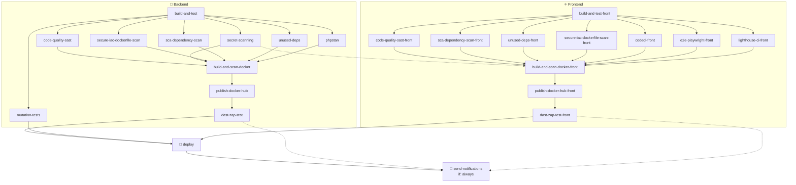

# Schéma de la pipeline CI/CD

Pipeline principale : [.github/workflows/main-pipeline.yml](../.github/workflows/main-pipeline.yml)

## Déclencheurs

- `push` sur `main` (chemins : `backend/**`, `frontend/**`, `docker/**`, `.github/workflows/**`)
- `pull_request` vers `main` (mêmes chemins)
- `schedule` : chaque lundi à 02h00 (`0 2 * * 1`)
- `workflow_dispatch` (manuel)

> Concurrence : un seul run par ref à la fois (`cancel-in-progress: true`).
> Le job `mutation-tests` est ignoré sur les pull requests.
> Le job `deploy` ne s'exécute que sur `push` vers `main`.

## Vue d'ensemble

## Étapes

### Branche Backend (PHP / Laravel)
| Job | Rôle |
|-----|------|
| `build-and-test` | Build + tests unitaires (racine de la branche) |
| `code-quality-sast` | Analyse statique de sécurité (Semgrep) |
| `secret-scanning` | Détection de secrets |
| `sca-dependency-scan` | Analyse des dépendances (SCA) |
| `unused-deps` | Détection de dépendances inutilisées |
| `secure-iac-dockerfile-scan` | Scan sécurité du Dockerfile (IaC) |
| `phpstan` | Analyse statique PHPStan |
| `mutation-tests` | Tests de mutation (hors PR) |
| `build-and-scan-docker` | Build + scan de l'image Docker |
| `publish-docker-hub` | Publication de l'image sur Docker Hub |
| `dast-zap-test` | Test dynamique de sécurité (OWASP ZAP) |

### Branche Frontend
| Job | Rôle |
|-----|------|
| `build-and-test-front` | Build + tests unitaires |
| `code-quality-sast-front` | Analyse statique de sécurité (Semgrep) |
| `sca-dependency-scan-front` | Analyse des dépendances (SCA) |
| `unused-deps-front` | Détection de dépendances inutilisées |
| `secure-iac-dockerfile-scan-front` | Scan sécurité du Dockerfile (IaC) |
| `codeql-front` | Analyse CodeQL |
| `e2e-playwright-front` | Tests end-to-end Playwright |
| `lighthouse-ci-front` | Audit performance/accessibilité Lighthouse |
| `build-and-scan-docker-front` | Build + scan de l'image Docker |
| `publish-docker-hub-front` | Publication de l'image sur Docker Hub |
| `dast-zap-test-front` | Test dynamique de sécurité (OWASP ZAP) |

### Convergence
| Job | Dépend de | Condition |
|-----|-----------|-----------|
| `deploy` | `dast-zap-test`, `mutation-tests`, `dast-zap-test-front` | `push` sur `main` uniquement |
| `send-notifications` | tous les jobs | `always()` — notifie par mail le résultat de chaque job |

> Note : `secret-scanning` (backend) est aussi une dépendance de `build-and-scan-docker-front` (arête en pointillés).
</content>
</invoke>
